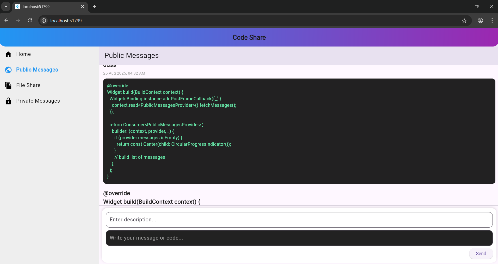
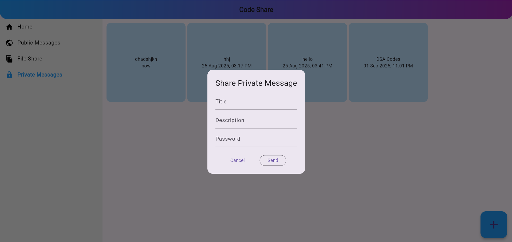
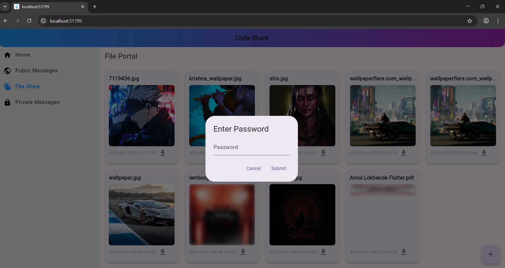
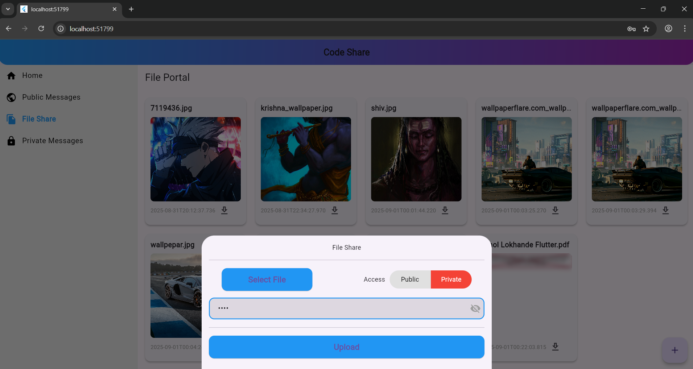
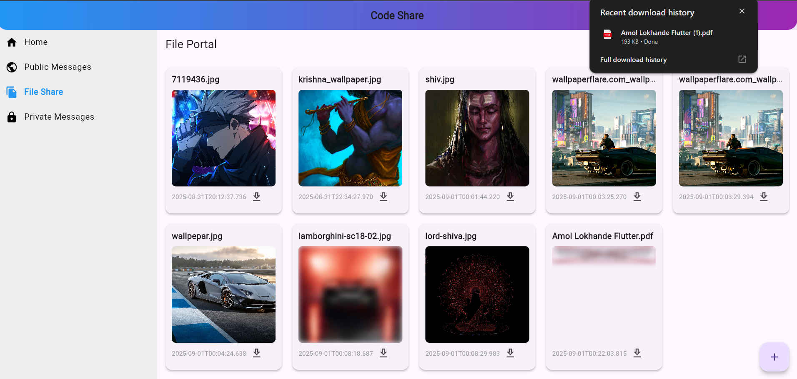

# 🔗 Code Share Project

A simple and secure **file sharing application** built with Flutter and Appwrite.  
Users can upload files, share them via password-protected links, and download them securely.  

---

## 🚀 Features
- 📤 Upload files securely  
- 🔑 Password-protected file sharing  
- 📂 Manage uploaded files in the dashboard  
- 📥 Download shared files with authentication  
- 🌐 Backend powered by **Appwrite**  
- 🎨 Clean and responsive UI  

---

## 📸 Screenshots

| Home Screen | PublicMessages Screen | PrivateMessages Screen | File Share Screen |
|-------------|-----------------------|------------------------|-------------------|
|  |  |  |  |  |  |  |  |

*(Add your screenshots inside `assets/screenshots/` and update the paths here.)*

---